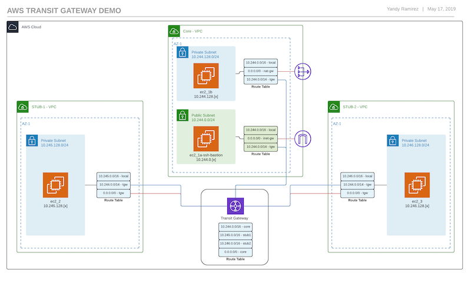

## Transit Gateway Demo

This repo has multiple branches, each with it's own set of features. They'll be branches for [any-to-any][1] **Transit Gateway** deployments. Meaning a **full-mesh** of VPC connections. In this design, the internet exit point is through the **Core VPC** but the VPCs are free to speak directly to each other. There's branches for [hub-and-spoke][2] type deployments where all traffic flows through the **transit (Core) VPC** and no traffic between spokes (stubs) is allowed. As well as other type of deployments such as **security-domain** segmentation (not built yet). These are only models and more thought is needed for production ready deployments.

## Any-to-Any

For the below deployment, where the **Transit Gateway** acts as a *core router* and any `VPC` can talk to any other `VPC` through the gateway, [click here][1].

### Any-to-Any Diagram

## Hub-and-Spoke Deployment

In this deployment, all the Core VPC is the exit point for all VPCs as well, though the spoke (stub) VPCs cannot speak to each other. They are isolated and only traffic from **Core to Spoke** is allowed or routed. For that code [click here][2].

### Hub-and-Spoke Diagram

[1]: https://github.com/IPyandy/aws-transit-gateway-demo/tree/any-to-any
[2]: https://github.com/IPyandy/aws-transit-gateway-demo/tree/hub-spoke