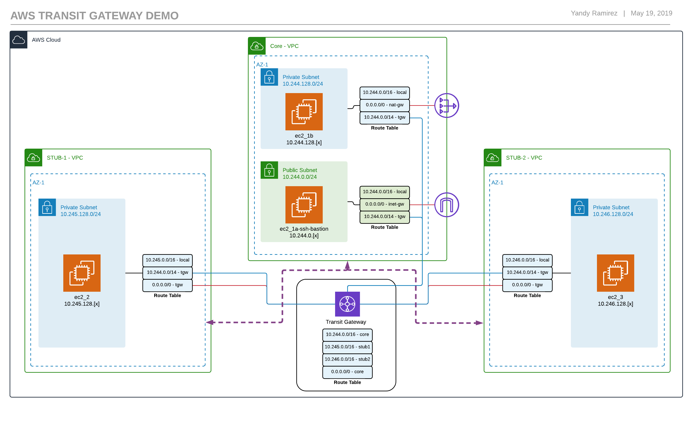

This deploys the infrastructure depicted in this diagram.

[](images/aws-transit-gateway-demo-hub-spoke.png)

## Terraform

Make sure you have `Terraform version 0.12.[x]` installed, at the time of this writting `0.12` is at release candidate 1. You need to have a `terraform.tfvars` or `*.auto.tfvars` file with the following keys set...

```hcl
domain_name = "YOUR-DOMAIN-NAME"
ssh_key_name = "AWS-SSH-KEY" # this key needs to exist in the AWS console
priv_ssh_key_path = "PATH-TO-YOUR-PRIVATE-KEY" -- must be the pair used to create the ssh_key_name in AWS
lab_public_ip = "your-public-ip" # this is used for the security group rule to allow SSH
```

These variables can also be passed in at `apply` or `plan` time with the command `terraform apply -var 'domain_name=test.domain`.

## Deploy

Make sure you have an AWS environment setup, the AWS CLI configured or environment variables with appropriate keys.

### Clone

`git clone https://github.com/IPyandy/aws-transit-gateway-demo.git`

### Plan and Deploy

```shell
cd aws-transit-gateway-demo

terraform init
terraform plan -o plan.tfplan
terraform apply plan.tfplan
```

## Connect to bastion Host

After **terraform** successfully deploys, there are outputs for each host public and private addresses. The only public address belongs to the bastion host. You can also find the public address in the AWS console. It is **important** that you have a copy of your private key on the machine, otherwise SSH won't work, but you know this already.

Here's what some of the terraform output looks like and what to look for.

```shell
...
ec2_core_private_ips = {
  "i-007352efa5e5c6a6c" = "10.244.128.10"
  "i-01a6870275133ddf6" = "10.244.0.10"
}
ec2_core_public_ips = {
  "i-01a6870275133ddf6" = "34.230.84.132"
}
ec2_spoke_private_ips = {
  "i-0317f033eb27c5e78" = "10.245.128.10"
  "i-0f68d441b2805b12a" = "10.246.128.10"
}0
...
```

Once you have the public IP address in order to connect from the bastion host to the rest of the `ec2` instances. Follow these steps.

-   Connect to the bastion host

`ssh -i [path-to-private-key] -o StrictHostKeyChecking=no ec2-user@[bastion-public-ip]`

-   From the bastion you can connect to other hosts
-   From those hosts connect back to Core VPC or to the internet
